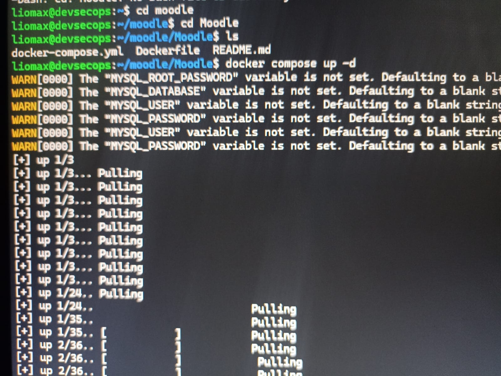
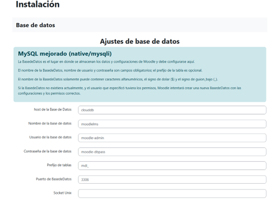
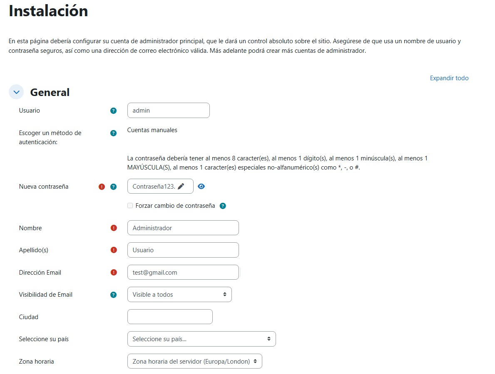
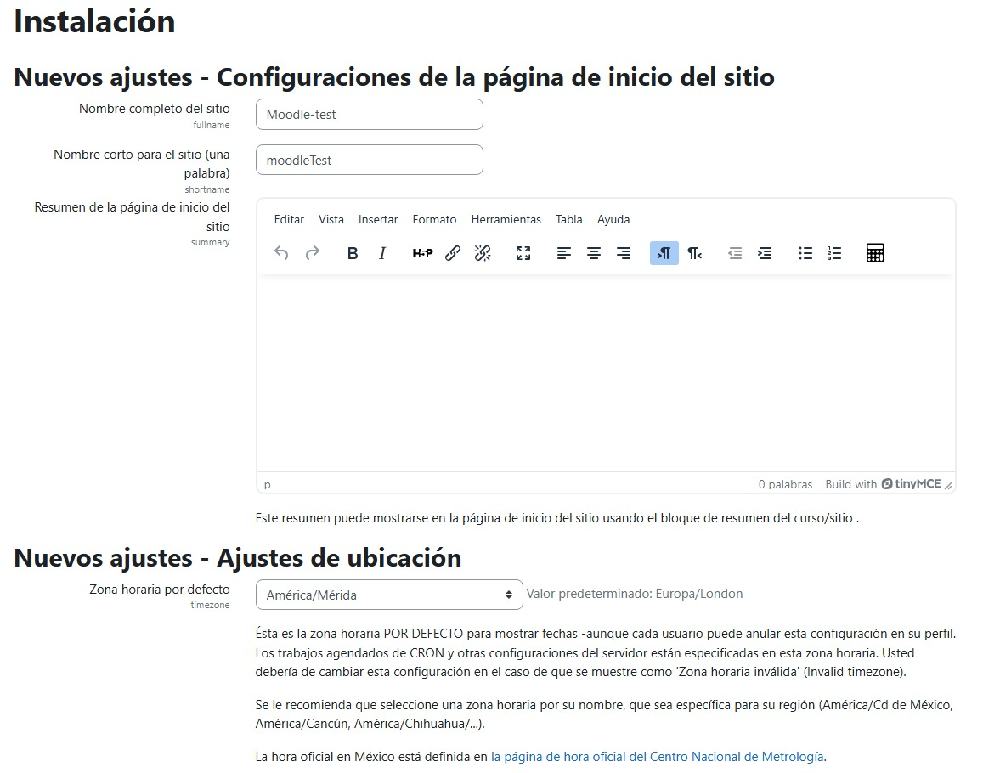
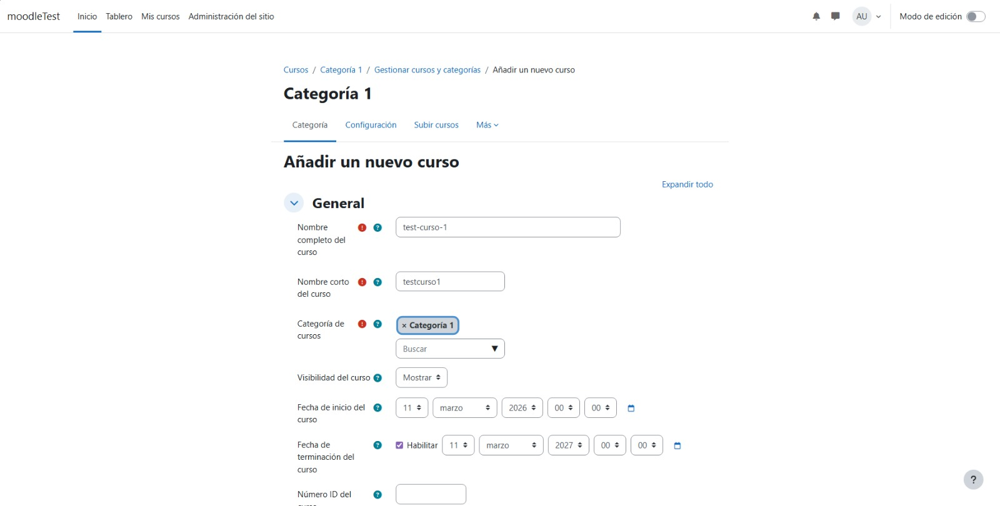
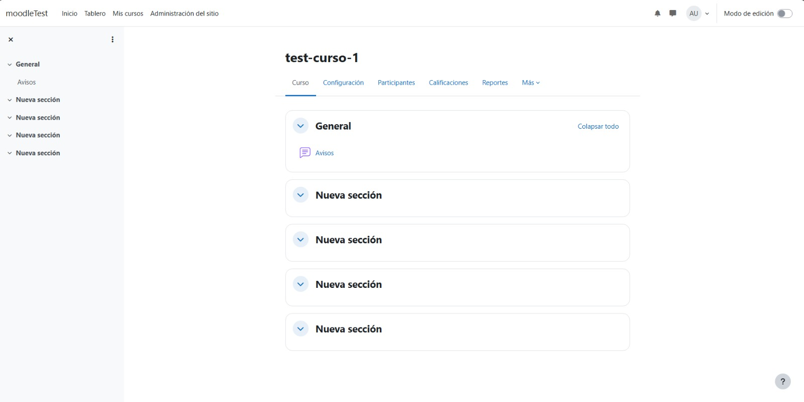
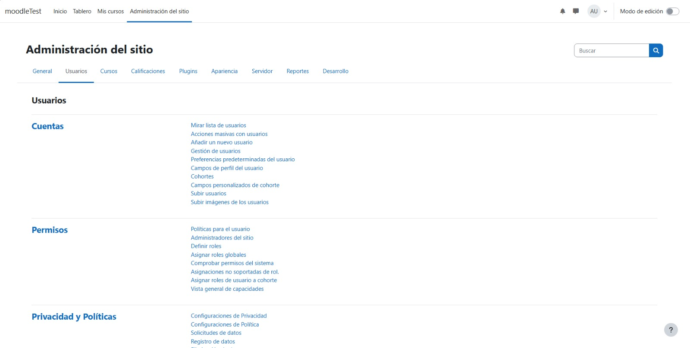
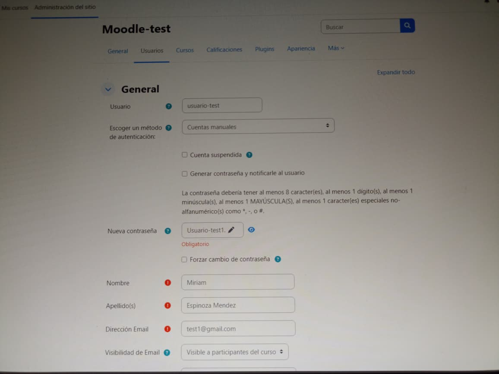
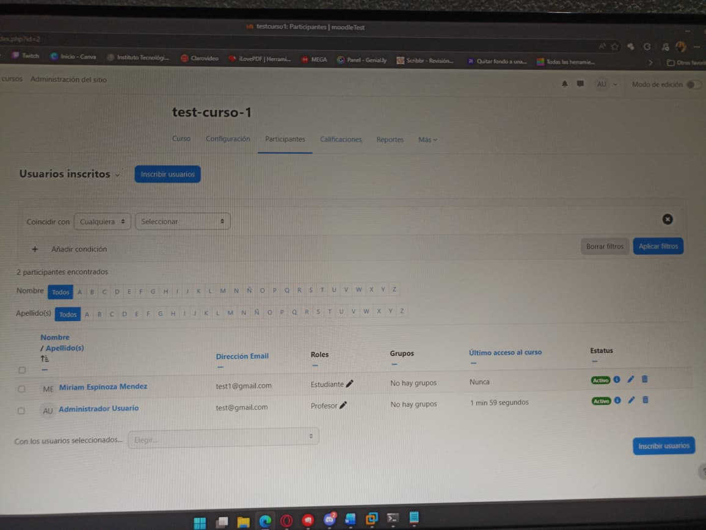
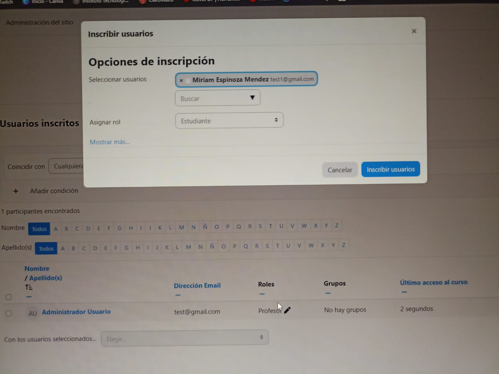

# Instalación y configuración de Moodle con sus dependencias
## Moodle y Docker-compose
- Instalación con docker-compose
## Requisitos previos
- Docker instalado.
- Git.
 ## Usuarios y Contraseñas de MySQL
- MYSQL_USER: moodle-admin
- MYSQL_PASSWORD: moodle-dbpass
- MYSQL_ROOT_PASSWORD: mysql-rootpass
 
## Correr localmente usando Docker
1. Clonar el repositorio al directorio local de instalación:
```bash
git clone https://github.com/marioadolfo14-lgtm/Moodle.git 
```
2. Para crear el contenedor por primera vez:
```bash
cd Moodle
```
```bash
docker compose up -d
```
3. Para detener los contenedores:
```bash
docker compose stop
```
4. Para inciar un contenedor ya creado:
```bash
docker compose start
```


# Paso 1) Correr Moodle y Configurar

- http://...ip.../install.php
- Configure...
  - Idioma
  - Ruta (predeterminado)
  - Selección de base de datos (predeterminado)
  - Ajuste de base de datos con los datos de la sig img

  - Confirmación los Términos y Condiciones
# Paso 2) Instalación de Moodle

- Instalación de la versión.
- Configuración de usuario administrador y demas datos
  - Usuario. **admin**
  - Contraseña **Contraseña123.**
  - Nombre, Apellidos, Email, etc.
 

- Configuración de la página de inicio del sitio
   - Nombre completo del sitio. **Moodle-test**
   - Nombre corto del sitio. **moodleTest**
   - Ubicación. **México**
   - Contacto y correo (poner el que desee)
 


# Paso 3) Inicio de Moodle y creación del curso
- Seleccionar **Mis cursos** -> Crear curso


# Paso 4) Creación de usuario en el Moodle
- Ir a **administración de sitio** -> **Cuentas** -> **Añadir un nuevo usuario** ( poner los datos requeridos)


# Paso 5) Añadir, inscribir y asignar de roles del usuario
- ir a **Mis cursos** -> **..nombre del curso..** -> **Participantes** -> **Inscribir usuarios** -> **Seleccionar usuarios** -> **Asignar rol**



  
